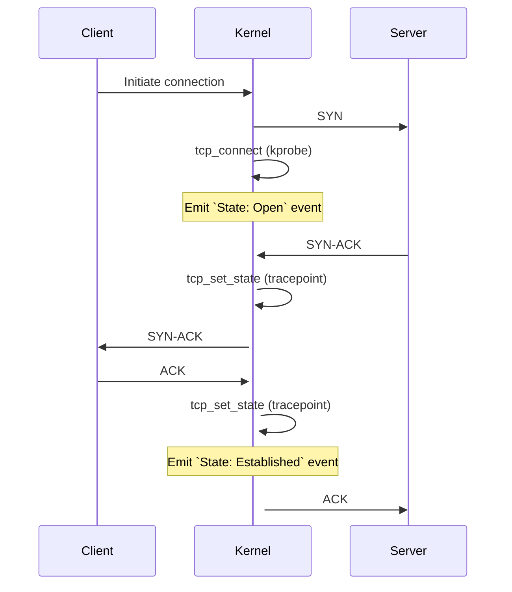
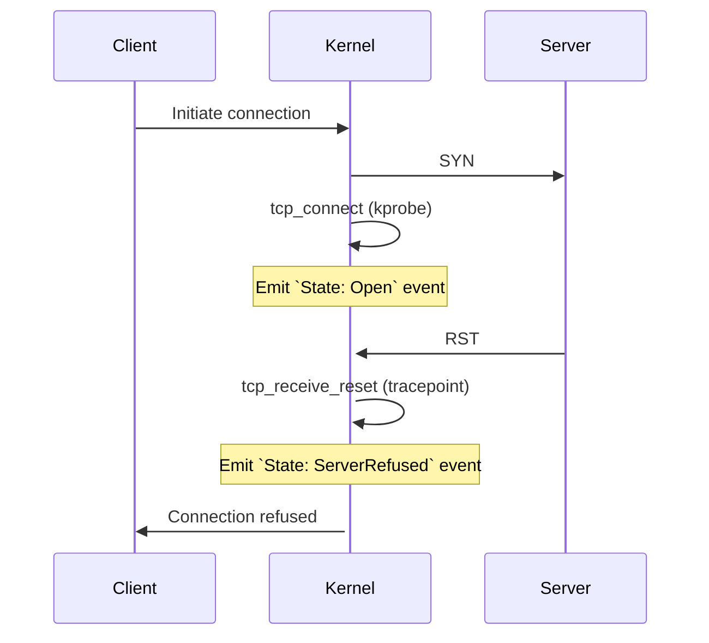
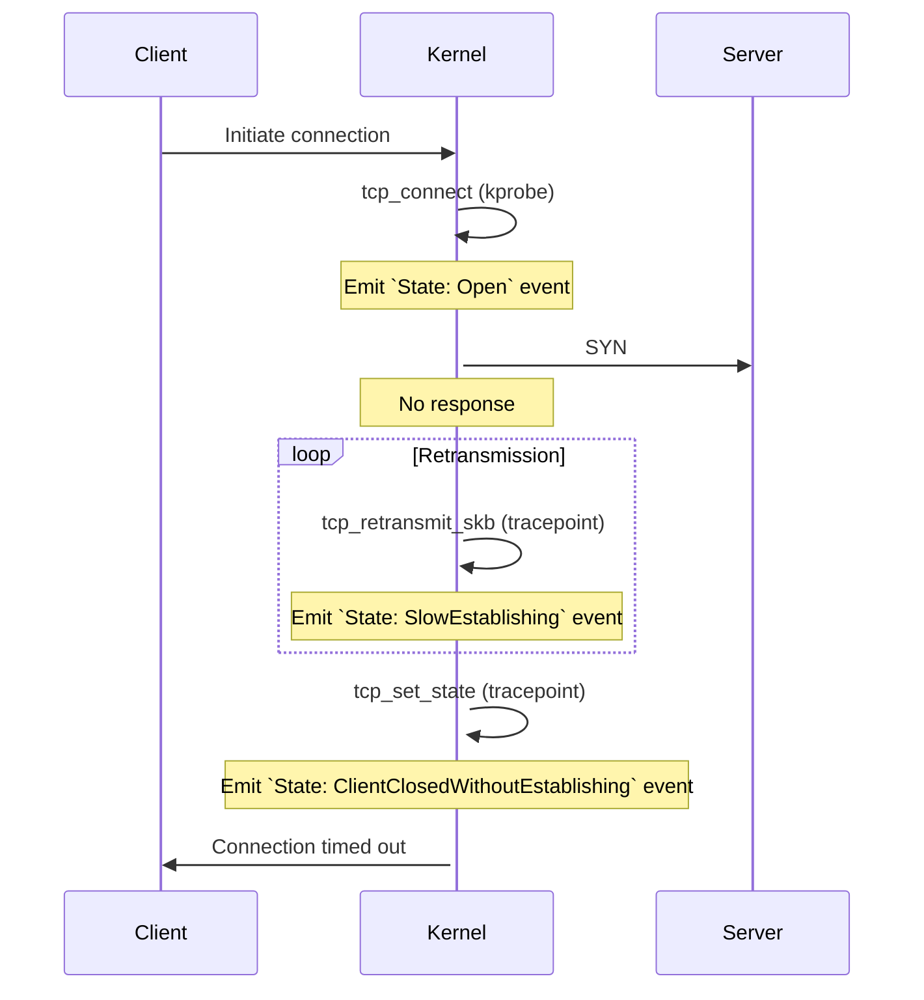
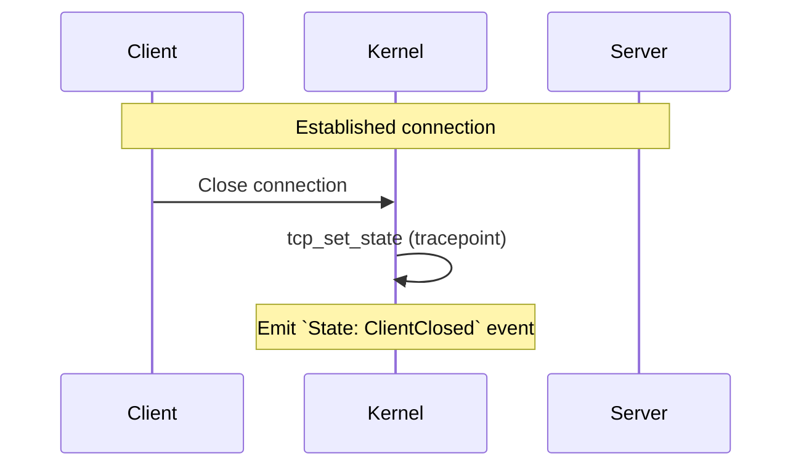

# ipvs-tcpstate

An implementation of [tcpstates.py](https://github.com/iovisor/bcc/blob/master/tools/tcpstates.py) using Aya, in Rust.

This repository will also de-reference the virtual IP from IPVS connections to the real server's address.

Running the example, you get something like this

```
# TCP transition 1 Close -> SynSent -- `dst` is virtual; unclear what the real IP is
TcpSocketEvent { oldstate: Close, newstate: SynSent, sport: 0, dport: 33, dst: 1.2.3.4, svc: None }
# TCP Transition 2 SynSent -> Established -- `dst` is virtual, but `svc.daddr` contains the real IP
TcpSocketEvent { oldstate: SynSent, newstate: Established, sport: 36572, dport: 33, dst: 1.2.3.4, svc: Some(IpvsDest { daddr: 192.168.2.1, dport: 22 }) }
TcpSocketEvent { oldstate: Established, newstate: FinWait1, sport: 36572, dport: 33, dst: 1.2.3.4, svc: Some(IpvsDest { daddr: 192.168.2.1, dport: 22 }) }
TcpSocketEvent { oldstate: FinWait1, newstate: FinWait2, sport: 36572, dport: 33, dst: 1.2.3.4, svc: Some(IpvsDest { daddr: 192.168.2.1, dport: 22 }) }
TcpSocketEvent { oldstate: FinWait2, newstate: Close, sport: 36572, dport: 33, dst: 1.2.3.4, svc: Some(IpvsDest { daddr: 192.168.2.1, dport: 22 }) }
```

For a connection that's timing out before establishing, a `TcpSocketEvent` will be sent per TCP retransmit, including the real server's address
```
# Open connection, svc is not known yet, as sport is not yet determined
TcpSocketEvent { oldstate: Close, newstate: SynSent, sport: 0, dport: 33, dst: 1.2.3.4, svc: None }
# Retransmit, includes real address, 1s later by default
TcpSocketEvent { oldstate: SynSent, newstate: SynSent, sport: 43782, dport: 33, dst: 1.2.3.4, svc: Some(IpvsDest { daddr: 8.8.8.8, dport: 33 }) }
TcpSocketEvent { oldstate: SynSent, newstate: SynSent, sport: 43782, dport: 33, dst: 1.2.3.4, svc: Some(IpvsDest { daddr: 8.8.8.8, dport: 33 }) }
TcpSocketEvent { oldstate: SynSent, newstate: SynSent, sport: 43782, dport: 33, dst: 1.2.3.4, svc: Some(IpvsDest { daddr: 8.8.8.8, dport: 33 }) }
TcpSocketEvent { oldstate: SynSent, newstate: SynSent, sport: 43782, dport: 33, dst: 1.2.3.4, svc: Some(IpvsDest { daddr: 8.8.8.8, dport: 33 }) }
TcpSocketEvent { oldstate: SynSent, newstate: Close, sport: 43782, dport: 33, dst: 1.2.3.4, svc: Some(IpvsDest { daddr: 8.8.8.8, dport: 33 }) }
```

This library does *not* return TcpSocketEvents where the svc is unknown, which filters out all non-IPVS events, but also the `Close->SynSent` transition.

## Diagrams

The behavior of the tracepoints / kprobes in this library can be explained with these diagrams:

Establishing a connection


Server refuses the connection


Server unreachable


Client closes connection


## Prerequisites

1. stable rust toolchains: `rustup toolchain install stable`
1. nightly rust toolchains: `rustup toolchain install nightly --component rust-src`
1. (if cross-compiling) rustup target: `rustup target add ${ARCH}-unknown-linux-musl`
1. (if cross-compiling) LLVM: (e.g.) `brew install llvm` (on macOS)
1. (if cross-compiling) C toolchain: (e.g.) [`brew install filosottile/musl-cross/musl-cross`](https://github.com/FiloSottile/homebrew-musl-cross) (on macOS)
1. bpf-linker: `cargo install bpf-linker` (`--no-default-features` on macOS)

## Build & Run

Use `cargo build`, `cargo check`, etc. as normal. Run your program with:

```shell
cargo run --release --config 'target."cfg(all())".runner="sudo -E"'
```

Cargo build scripts are used to automatically build the eBPF correctly and include it in the
program.

## Run tests
```shell
make unit-tests
make integration-tests
# or both:
make test
```
Integration tests require having [firetest](https://github.com/DavidVentura/firetest) in PATH.

It's important that `.cargo/config.toml` uses a target with static binary output (like musl).

## Generate headers

```bash
$ make bindings
```

`trace_event_raw_inet_sock_set_state` comes from

```
$ grep inet_sock_set_state /proc/kallsyms    | grep trace_ev
0000000000000000 t __pfx_trace_event_raw_event_inet_sock_set_state
0000000000000000 t trace_event_raw_event_inet_sock_set_state
```

where `trace_event_raw_event_inet_sock_set_state` (kallsym output) has the word `event` removed (`trace_event_raw_event...` -> `trace_event_raw...`)

Similarly, `trace_event_raw_event_tcp_event_sk_skb` (kallsym output) becomes `trace_event_raw_tcp_event_sk_skb`
